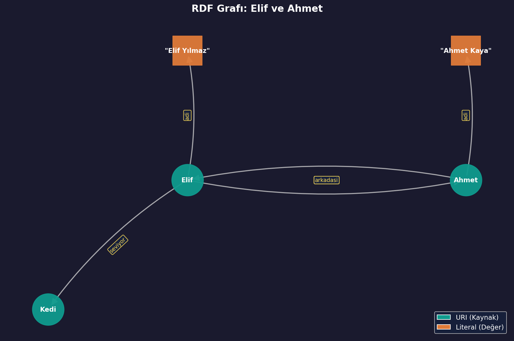
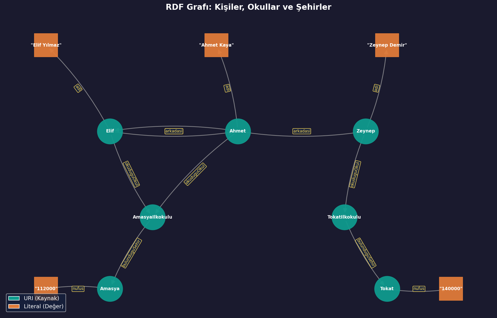

# RDF Nedir ve Neden Gereklidir?

## XML Yeterli Değil mi?

Önceki haftalarda XML, DTD ve XML Schema ile verinin nasıl yapılandırılacağı ve doğrulanacağı ayrıntılı olarak işlenmişti. XML çok güçlü bir teknolojidir: veriye biçim verir, kurallara uygunluğunu denetler ve farklı sistemler arasında veri taşınmasını sağlar. Ancak XML'in önemli bir sınırlaması vardır: **verinin ne anlama geldiğini bilmez**.

Bir XML belgesinde `<ad>Elif Yılmaz</ad>` yazdığında bilgisayar şunu görür: "ad" etiketinin içinde "Elif Yılmaz" metni var. Ama bilgisayar şu soruların hiçbirini cevaplayamaz:

- Elif Yılmaz bir kişi mi, bir şirket mi, bir kitap mı?
- "ad" etiketi bir isim mi, bir adım mı, bir ada mı?
- Bu bilgi başka bir belgedeki "Elif Yılmaz" ile aynı kişiyi mi kastediyor?

XML, veriyi **insanların okuması** için güzelce düzenler ama **bilgisayarın anlaması** için yeterli ipucu vermez. Bu, bir **etiketlenmiş kutu** gibi düşünülebilir. Kutunun üzerine "Elma" yazmak, insanın anlamasını sağlar. Ama bir robot, kutunun üzerindeki yazıyı okusa bile elmanın bir meyve olduğunu, yenilebilir olduğunu veya ağaçta yetiştiğini **bilemez**.

İşte RDF (Resource Description Framework), tam olarak bu sorunu çözmek için tasarlanmış bir teknolojidir. RDF, bilgiyi bilgisayarların **anlayabileceği** ve **işleyebileceği** bir biçimde ifade eder.

Aşağıdaki uygulama bu farkı somut olarak gösteriyor. Aynı bilgi önce XML ile, sonra RDF ile ifade ediliyor:

```
=======================================================
XML ile aynı bilgiyi ifade etmek:
=======================================================

<ogrenci>
  <ad>Elif Yılmaz</ad>
  <yas>10</yas>
  <okul>Amasya İlkokulu</okul>
</ogrenci>

Bu XML belgesinde:
  - "Elif Yılmaz" bir metin parçasıdır.
  - Bilgisayar, Elif'in bir kişi olduğunu bilemez.
  - Bilgisayar, okulun bir kurum olduğunu bilemez.
  - Bilgiler arasındaki ilişki belirsizdir.

=======================================================
RDF ile aynı bilgiyi ifade etmek:
=======================================================

  ex:Elif  →  ex:adi  →  Elif Yılmaz
  ex:Elif  →  ex:yasi  →  10
  ex:Elif  →  ex:okuduguOkul  →  ex:AmasyaIlkokulu

Bu RDF verisinde:
  - ex:Elif benzersiz bir kimliğe (URI) sahiptir.
  - ex:AmasyaIlkokulu da benzersiz bir kimliğe sahiptir.
  - Her bilgi parçası açık bir ilişki ifade eder.
  - Bilgisayar bu ilişkileri anlayabilir ve işleyebilir.
```

RDF'de her şeyin benzersiz bir kimliği (URI) var. `ex:Elif` dünyanın neresinde kullanılırsa kullanılsın hep aynı Elif'i işaret eder. XML'de ise "Elif" metni bir belgede bir kişi, başka bir belgede bir şehir adı bile olabilir.

---

## RDF Veri Modeli: Üçlüler (Triple)

### Her Bilgi Bir Cümledir

RDF'nin temel yapı taşı **üçlü** (triple) adı verilen yapıdır. Her üçlü, tam olarak üç parçadan oluşur:

- **Özne** (Subject): Hakkında bilgi verilen şey.
- **Yüklem** (Predicate): Öznenin hangi özelliği veya ilişkisi hakkında konuşulduğu.
- **Nesne** (Object): O özelliğin değeri veya ilişkinin hedefi.

Bu yapı, Türkçe'deki basit cümlelere çok benzer. "Elif kedileri seviyor" cümlesi düşünülürse:

- Özne: **Elif** (hakkında konuşulan kişi)
- Yüklem: **seviyor** (ne yaptığı)
- Nesne: **Kedi** (eylemin hedefi)

RDF, **dünyadaki her bilgiyi** bu üçlü yapıya dönüştürür. Ne kadar karmaşık bir bilgi olursa olsun, sonunda küçük üçlülere parçalanabilir. Bu, bir **LEGO seti** gibi düşünülebilir. LEGO'da her parça küçük ve basittir. Ama küçük parçalar bir araya geldiğinde karmaşık yapılar oluşur. RDF'de de her üçlü küçük ve basittir ama üçlüler bir araya geldiğinde zengin bir bilgi ağı ortaya çıkar.

---

### İlk Üçlüyü Yazmak

RDF verileri farklı formatlarda yazılabilir. En okunabilir format **Turtle** (Terse RDF Triple Language) formatıdır. Turtle formatında bir üçlü şöyle yazılır:

```turtle
@prefix ex: <http://ornek.com/> .

ex:Elif  ex:seviyor  ex:Kedi .
```

Bu dosyayı satır satır incelemek gerekirse:

- `@prefix ex: <http://ornek.com/> .` → "ex" kısaltmasının `http://ornek.com/` adresini temsil ettiğini belirtir. Bu, XML'deki namespace tanımına benzer. Her seferinde uzun URI yazmak yerine `ex:Elif` gibi kısa yazılmasını sağlar.
- `ex:Elif  ex:seviyor  ex:Kedi .` → Bir üçlü: Elif seviyor Kedi. Nokta (`.`) üçlünün bittiğini belirtir.

Bu dosya Python'un `rdflib` kütüphanesiyle okunduğunda:

```python
from rdflib import Graph

g = Graph()
g.parse("ilk_uclu.ttl", format="turtle")

print(f"Üçlü sayısı: {len(g)}")
for ozne, yuklem, nesne in g:
    print(f"  Özne  : {ozne}")
    print(f"  Yüklem: {yuklem}")
    print(f"  Nesne : {nesne}")
```

Çıktı:

```
Üçlü sayısı: 1

  Özne  : http://ornek.com/Elif
  Yüklem: http://ornek.com/seviyor
  Nesne : http://ornek.com/Kedi
```

Tek bir üçlü var ve üç parçası açıkça görülüyor. `ex:Elif` kısaltması açıldığında `http://ornek.com/Elif` olur. Bu URI, Elif'in benzersiz kimliğidir. Dünyanın her yerinde bu URI "Elif" anlamına gelir.

---

### Birden Fazla Üçlü ile Bilgi Ağı Kurmak

Bir üçlü tek bir bilgi parçasını ifade eder. Gerçek dünyada ise bir kişi hakkında birçok bilgi vardır. Her bilgi ayrı bir üçlü olarak yazılır ve hepsi bir araya geldiğinde bir **bilgi ağı** oluşur.

```turtle
@prefix ex: <http://ornek.com/> .

ex:Elif  ex:adi         "Elif Yılmaz" .
ex:Elif  ex:yasi        "10" .
ex:Elif  ex:okuduguOkul ex:AmasyaIlkokulu .
ex:Elif  ex:seviyor     ex:Kedi .
ex:Elif  ex:arkadasi    ex:Ahmet .

ex:Ahmet ex:adi         "Ahmet Kaya" .
ex:Ahmet ex:arkadasi    ex:Elif .
```

Bu dosyada yedi üçlü var. Beşi Elif hakkında, ikisi Ahmet hakkında. Bazı üçlülerde nesne bir metin değeridir (`"Elif Yılmaz"`, `"10"`), bazılarında ise başka bir kaynağa işaret eden URI'dir (`ex:AmasyaIlkokulu`, `ex:Kedi`, `ex:Ahmet`). Metin değerlerine **literal** denir. URI'lere ise **kaynak** (resource) denir. Bu ayrım RDF'nin en önemli özelliklerinden biridir ve bir sonraki bölümde ayrıntılı olarak işlenecek.

Bu dosya okunduğunda:

```
Toplam üçlü sayısı: 7

  Üçlü 1: ex:Elif   →  ex:seviyor      →  ex:Kedi
  Üçlü 2: ex:Ahmet  →  ex:arkadasi     →  ex:Elif
  Üçlü 3: ex:Elif   →  ex:adi          →  Elif Yılmaz
  Üçlü 4: ex:Elif   →  ex:okuduguOkul  →  ex:AmasyaIlkokulu
  Üçlü 5: ex:Elif   →  ex:arkadasi     →  ex:Ahmet
  Üçlü 6: ex:Ahmet  →  ex:adi          →  Ahmet Kaya
  Üçlü 7: ex:Elif   →  ex:yasi         →  10
```

Yedi küçük cümle, iki kişi hakkında zengin bir bilgi ağı oluşturmuş durumda. Elif'in adı, yaşı, okulu, sevdiği hayvan ve arkadaşı bilinmektedir. Ahmet'in de adı ve arkadaşı bilinmektedir. Üstelik Elif'in arkadaşı Ahmet ve Ahmet'in arkadaşı Elif olduğu için ikisi arasında **çift yönlü bir bağ** vardır.

---

### Belirli Bir Kaynak Hakkında Sorgulama

RDF'nin gücü, bu üçlüler üzerinde **sorgulama** yapabilmekte yatıyor. Örneğin "Elif hakkında ne biliyoruz?" sorusu, yalnızca öznesi `ex:Elif` olan üçlüleri getirerek cevaplanabilir:

```python
from rdflib import Graph, URIRef

g = Graph()
g.parse("elif_bilgileri.ttl", format="turtle")

elif_uri = URIRef("http://ornek.com/Elif")

print("Elif hakkındaki tüm bilgiler:")
for yuklem, nesne in g.predicate_objects(elif_uri):
    yk = str(yuklem).replace("http://ornek.com/", "ex:")
    ns = str(nesne).replace("http://ornek.com/", "ex:")
    print(f"  Elif  →  {yk}  →  {ns}")
```

Çıktı:

```
Elif hakkındaki tüm bilgiler:

  Elif  →  ex:adi          →  Elif Yılmaz
  Elif  →  ex:yasi         →  10
  Elif  →  ex:okuduguOkul  →  ex:AmasyaIlkokulu
  Elif  →  ex:seviyor      →  ex:Kedi
  Elif  →  ex:arkadasi     →  ex:Ahmet

Elif hakkında 5 bilgi bulundu.
```

Yedi üçlü içinden yalnızca Elif'e ait olan beşi getirildi. Bu, XML'de yapılması çok daha zor olan bir işlemdir. XML'de "Elif" metnini aramak gerekir ve bu arama yalnızca metin eşleştirmesine dayanır. RDF'de ise `ex:Elif` URI'sine sahip kaynağın tüm ilişkileri doğrudan sorgulanabilir. Bilgisayar, Elif'in ne olduğunu değil ama Elif hakkında **ne bilindiğini** tam olarak bilmektedir.

Bir **dosya dolabı** benzetmesi yapılabilir. XML'de tüm belgeler tek bir çekmecede karışık hâlde durur ve "Elif" yazan kağıtları bulmak için hepsini tek tek karıştırmak gerekir. RDF'de ise her kişinin kendi çekmecesi vardır. "Elif'in çekmecesi" açıldığında, onunla ilgili tüm bilgiler düzenli biçimde orada bulunur.


# URI'ler ve Literal Değerler

## Her Şeyin Bir Adresi Var: URI

Önceki bölümde her üçlünün üç parçası olduğu görülmüştü: özne, yüklem, nesne. Ama bu parçalar nasıl ifade ediliyor? RDF'de bir şeye işaret etmenin iki temel yolu vardır: **URI** ve **Literal**. Bu ikisi arasındaki fark, RDF'nin en temel kavramlarından biridir.

**URI** (Uniform Resource Identifier), bir kaynağı benzersiz olarak tanımlayan bir adrestir. İnternet adresleri (URL'ler) bir tür URI'dir ama URI'ler yalnızca web sayfalarını değil, dünyadaki **her şeyi** tanımlayabilir: bir kişiyi, bir şehri, bir kavramı, bir hayvanı.

Bu durum, **T.C. kimlik numarası** gibi düşünülebilir. Türkiye'de her vatandaşın benzersiz bir kimlik numarası vardır. İki farklı kişi aynı numaraya sahip olamaz. Bu numara sayesinde kişi, isim karışıklığı olmadan kesin olarak tanımlanır. URI de aynı şeyi yapar: her kaynağa dünyada benzersiz bir tanımlayıcı verir.

Aşağıdaki örnekte iki kişi aynı şehirde doğmuş. Her ikisinin doğum yeri için aynı URI kullanılıyor:

```turtle
@prefix ex: <http://ornek.com/> .
@prefix dbr: <http://dbpedia.org/resource/> .

ex:Elif  ex:dogumYeri  dbr:Amasya .
ex:Ahmet ex:dogumYeri  dbr:Amasya .
```

Burada `dbr:Amasya` ifadesi, DBpedia'daki (Wikipedia'nın yapılandırılmış veri versiyonu) Amasya kaynağına işaret ediyor. Bu URI açıldığında `http://dbpedia.org/resource/Amasya` olur. Hem Elif'in hem Ahmet'in doğum yeri **aynı URI**'yi gösteriyor. Bu sayede bilgisayar, ikisinin aynı şehirde doğduğunu kesin olarak biliyor.

Bu dosya çalıştırıldığında:

```
Tüm üçlüler:

  ex:Elif   →  ex:dogumYeri  →  dbr:Amasya
  ex:Ahmet  →  ex:dogumYeri  →  dbr:Amasya

dbr:Amasya URI'si: http://dbpedia.org/resource/Amasya

Amasya'da doğan kişiler:
  ex:Elif
  ex:Ahmet
```

"Amasya'da doğan kişiler kim?" sorusu, nesnesi `dbr:Amasya` olan tüm üçlülerin öznelerini getirerek cevaplanmış. URI'ler sayesinde aynı şeye işaret eden tüm bilgiler birbirine bağlanabiliyor.

---

## URI ile Literal Arasındaki Fark

Bir üçlünün nesne kısmında iki farklı şey bulunabilir:

- **URI**: Başka bir kaynağa **bağlantı**. O kaynağın kendisi hakkında da başka üçlüler olabilir.
- **Literal**: Düz bir **değer**. Bir metin, bir sayı, bir tarih. Başka hiçbir şeye bağlantısı yoktur.

Bu fark çok önemlidir. Bir **kapı** benzetmesi yapılabilir: URI bir kapıdır. Kapıyı açınca arkasında yeni bir oda var ve o odada da başka bilgiler bulunuyor. Literal ise bir **duvara asılmış tablo**dur. Tabloda bir yazı var ama tablonun arkasında başka bir oda yok. Yazı orada başlar ve orada biter.

Aşağıdaki örnekte aynı isim ("Ahmet") hem URI hem de literal olarak kullanılmış:

```turtle
@prefix ex: <http://ornek.com/> .

ex:Elif  ex:arkadasi       ex:Ahmet .
ex:Elif  ex:enYakinArkadas "Ahmet" .
```

Bu iki üçlü çalıştırıldığında fark açıkça görülüyor:

```
URI ve Literal farkı:

  ex:Elif  →  ex:arkadasi           →  ex:Ahmet
       Nesne türü: URI (başka bir kaynağa bağlantı)
       Gerçek değer: http://ornek.com/Ahmet

  ex:Elif  →  ex:enYakinArkadas     →  "Ahmet"
       Nesne türü: Literal (düz metin)
       Gerçek değer: Ahmet

Fark:
  URI (ex:Ahmet)   → Bir kimliği olan varlık. Hakkında başka bilgiler eklenebilir.
  Literal ("Ahmet") → Sadece bir metin. Başka bilgi eklenemez.
```

`ex:Ahmet` bir URI'dir. Bu URI'nin arkasında Ahmet hakkında başka üçlüler bulunabilir: adı, yaşı, okulu, arkadaşları. Bağlantı canlıdır; izlenebilir. `"Ahmet"` ise bir literal'dir. Sadece dört harflik bir metin. Bu metne başka bilgi eklenemez. Bilgisayar bu metnin bir kişi adı mı, bir şehir adı mı, bir marka adı mı olduğunu bilemez.

Genel kural şudur: eğer bir şey hakkında **başka bilgiler de ifade edilecekse** URI kullanılır. Eğer bir şey sadece bir **değerse** (isim, sayı, tarih gibi) literal kullanılır.

---

## Literal Türleri

Literal'ler yalnızca düz metin değildir. XML Schema'dan tanıdık gelen veri tipleri burada da geçerlidir. RDF'de üç tür literal bulunur:

### Düz Metin Literal (Plain Literal)

Tırnak içinde yazılan ve hiçbir tip bilgisi taşımayan değerlerdir:

```turtle
ex:Elif  ex:adi  "Elif Yılmaz" .
```

Bilgisayar bu değerin bir metin olduğunu bilir ama bunun ötesinde bir şey bilmez.

### Tipli Literal (Typed Literal)

Değerin yanına `^^` işareti ve bir veri tipi eklenerek oluşturulur. XML Schema veri tipleri (`xsd:integer`, `xsd:decimal`, `xsd:boolean`, `xsd:date` vb.) kullanılır:

```turtle
@prefix xsd: <http://www.w3.org/2001/XMLSchema#> .

ex:Elif  ex:yasi        "10"^^xsd:integer .
ex:Elif  ex:boyu        "1.42"^^xsd:decimal .
ex:Elif  ex:opiGectiMi  "true"^^xsd:boolean .
ex:Elif  ex:dogumTarihi "2016-05-12"^^xsd:date .
```

Bu dosya çalıştırıldığında her değerin tipi görülebilir:

```
Elif'in bilgileri ve veri tipleri:

  ex:yasi                →  10                (tip: xsd:integer)
  ex:opiGectiMi          →  true              (tip: xsd:boolean)
  ex:boyu                →  1.42              (tip: xsd:decimal)
  ex:dogumTarihi         →  2016-05-12        (tip: xsd:date)
  ex:adi                 →  Elif Yılmaz       (tip: düz metin)
```

Tipli literal'lerin büyük avantajı, bilgisayarın bu değerlerle **işlem yapabilmesi**dir. Bir sayı olduğunu bilen bilgisayar, o sayıyı toplayabilir, karşılaştırabilir veya sıralayabilir. Aşağıdaki uygulama bunu gösteriyor:

```python
from rdflib import Graph

g = Graph()
g.parse(data=ttl, format="turtle")  # Üç kişinin yaşı tanımlı

yas_toplam = 0
kisi_sayisi = 0
for s, p, o in g:
    yas = int(o)          # Tipli literal olduğu için sayıya çevrilebilir
    yas_toplam += yas
    kisi_sayisi += 1

ortalama = yas_toplam / kisi_sayisi
```

Çıktı:

```
Kişilerin yaşları:

  ex:Zeynep    → yaş: 9
  ex:Elif      → yaş: 10
  ex:Ahmet     → yaş: 11

Yaş ortalaması: 30 / 3 = 10.0

Bu hesaplama yapılabildi çünkü yaş değerleri
xsd:integer tipinde tanımlandı. Düz metin olsaydı
bilgisayar bunların sayı olduğunu bilemezdi.
```

Tipli literal'ler, XML Schema'daki veri tiplerinin RDF dünyasına taşınmış hâlidir. Önceki haftalarda `xs:integer`, `xs:date`, `xs:boolean` gibi tipler XML Schema'da kullanılmıştı. Şimdi aynı tipler `xsd:integer`, `xsd:date`, `xsd:boolean` olarak RDF'de kullanılıyor. Temel mantık aynı; sadece kullanıldığı ortam değişmiş.

### Dil Etiketli Literal (Language-Tagged Literal)

Bir metin değerinin hangi dilde yazıldığını belirtmek için `@` işareti ve dil kodu eklenir. Bu, aynı bilginin birden fazla dilde ifade edilmesini sağlar:

```turtle
ex:Amasya  ex:aciklama  "Amasya, Türkiye'nin Karadeniz Bölgesi'nde bir ildir."@tr .
ex:Amasya  ex:aciklama  "Amasya is a province in the Black Sea region of Turkey."@en .
ex:Amasya  ex:aciklama  "Amasya ist eine Provinz in der Schwarzmeerregion der Türkei."@de .
```

Aynı kaynak (`ex:Amasya`), aynı yüklem (`ex:aciklama`) ama üç farklı dilde üç farklı literal. Bu üç üçlü birbirine aykırı değildir; hepsi aynı anda geçerlidir.

Bu dosya çalıştırıldığında:

```
Amasya hakkında açıklamalar:

  Dil: en    →  Amasya is a province in the Black Sea region of Turkey.
  Dil: de    →  Amasya ist eine Provinz in der Schwarzmeerregion der Türkei.
  Dil: tr    →  Amasya, Türkiye'nin Karadeniz Bölgesi'nde bir ildir.

Sadece Türkçe açıklama:
  Amasya, Türkiye'nin Karadeniz Bölgesi'nde bir ildir.
```

Dil etiketi sayesinde bir uygulama, kullanıcının diline göre doğru açıklamayı otomatik olarak seçebilir. Türkçe kullanan birine `@tr` etiketli açıklama, İngilizce kullanan birine `@en` etiketli açıklama gösterilir. Bu, web sitelerinin çok dilli içerik sunmasının temelini oluşturur.

---

## Bir Üçlüde Ne Nerede Olabilir?

RDF'nin kuralları nettir. Her parçada her şey kullanılamaz:

| Konum | URI olabilir mi? | Literal olabilir mi? |
|---|---|---|
| **Özne** | Evet | Hayır |
| **Yüklem** | Evet | Hayır |
| **Nesne** | Evet | Evet |

Özne her zaman bir URI'dir çünkü hakkında konuşulan şeyin benzersiz bir kimliği olmalıdır. Yüklem de her zaman bir URI'dir çünkü ilişkinin kendisi de evrensel olarak tanınmalıdır. Yalnızca nesne hem URI hem de literal olabilir. Nesne bir kaynağa bağlantı veriyorsa URI, bir değer taşıyorsa literal kullanılır.

Bu kural, bir **cümle yapısı** gibi düşünülebilir. "Elif okula gidiyor" cümlesinde özne ("Elif") ve yüklem ("gidiyor") her zaman tanımlı kavramlardır. Ama nesne bazen somut bir yer ("okul" → URI) bazen de soyut bir değer ("mutlu" → literal) olabilir: "Elif mutlu hissediyor".

# RDF Grafları ve Görselleştirme

## Üçlülerden Grafa

Önceki bölümlerde RDF'nin temel yapı taşı olan üçlüler (triple) ve bu üçlülerde kullanılan URI'ler ile literal'ler işlenmişti. Şimdi bu üçlülerin bir araya geldiğinde nasıl bir yapı oluşturduğuna bakmak gerekiyor.

RDF verisi özünde bir **graf** (çizge) yapısıdır. Graflar, **düğümler** (noktalar) ve bu düğümleri birbirine bağlayan **kenarlardan** (çizgiler) oluşur. Bir üçlüdeki özne ve nesne birer düğüm, yüklem ise bu düğümleri birbirine bağlayan bir kenardır. Kenarın bir yönü vardır: özneden nesneye doğru gider. Bu yüzden RDF grafları **yönlü graf** (directed graph) olarak adlandırılır.

Bu durum, bir **şehirler arası otobüs hattı haritası** gibi düşünülebilir. Haritada şehirler birer noktadır (düğüm). Şehirleri birbirine bağlayan otobüs hatları birer çizgidir (kenar). Ve her hattın bir yönü vardır: Amasya'dan Tokat'a giden hat, Tokat'tan Amasya'ya giden hatla aynı şey değildir.

---

## Bir Grafın Yapısı: Düğümler ve Kenarlar

Aşağıdaki Turtle dosyasındaki beş üçlünün grafta nasıl göründüğü incelenecek:

```turtle
@prefix ex: <http://ornek.com/> .

ex:Elif  ex:adi       "Elif Yılmaz" .
ex:Elif  ex:arkadasi  ex:Ahmet .
ex:Elif  ex:seviyor   ex:Kedi .
ex:Ahmet ex:adi       "Ahmet Kaya" .
ex:Ahmet ex:arkadasi  ex:Elif .
```

Bu veri Python ile çözümlendiğinde grafın düğümleri ve kenarları ortaya çıkıyor:

```
RDF Grafı - Düğümler (Nodes):

  ■ "Ahmet Kaya"        [Literal - Değer]
  ■ "Elif Yılmaz"       [Literal - Değer]
  ● ex:Ahmet            [URI - Kaynak]
  ● ex:Elif             [URI - Kaynak]
  ● ex:Kedi             [URI - Kaynak]

Toplam düğüm sayısı: 5

RDF Grafı - Kenarlar (Edges):

  ex:Elif   ——[ex:adi]——▶      "Elif Yılmaz"
  ex:Elif   ——[ex:seviyor]——▶  ex:Kedi
  ex:Ahmet  ——[ex:arkadasi]——▶ ex:Elif
  ex:Ahmet  ——[ex:adi]——▶      "Ahmet Kaya"
  ex:Elif   ——[ex:arkadasi]——▶ ex:Ahmet

Toplam kenar sayısı: 5
```

Beş üçlü, beş düğüm ve beş kenar oluşturmuş. Grafta iki tür düğüm var: URI düğümleri (●) ve literal düğümleri (■). URI düğümlerinden başka kenarlara çıkılabilir çünkü bunlar birer kaynak. Literal düğümleri ise birer son noktadır; onlardan başka bir yere gidilemez.

---

## Grafı Görselleştirmek

Düğüm ve kenar listesi grafın yapısını anlatır ama **görseli** çok daha etkilidir. Aşağıdaki görsel, yukarıdaki beş üçlünün oluşturduğu grafı göstermektedir:



Bu görselde:

- **Yeşil daireler** (●) URI düğümleridir: Elif, Ahmet, Kedi. Bunlar birer kaynaktır ve başka düğümlere bağlantı verebilir.
- **Turuncu kareler** (■) literal düğümleridir: "Elif Yılmaz", "Ahmet Kaya". Bunlar birer değerdir ve burada yol biter.
- **Oklar** kenarları temsil eder. Her okun üzerinde yüklem yazılıdır: `adi`, `arkadasi`, `seviyor`.
- Elif ile Ahmet arasında **iki yönlü bağlantı** var: Elif → arkadasi → Ahmet ve Ahmet → arkadasi → Elif. Bu iki ayrı üçlüdür ve grafta iki ayrı ok olarak görünür.

Görsel, metin listesinden çok daha hızlı anlaşılıyor. Bir bakışta kimlerin birbirine bağlı olduğu, hangi bilgilerin nerede durduğu görülebiliyor.

---

## Grafta Yürümek: Bağlantıları İzlemek

RDF graflarının en güçlü özelliği, düğümler arasında **yürüyerek** yeni bilgilere ulaşabilmektir. Bir düğümden başlanır, kenarlar izlenir ve adım adım ilerlendiğinde başlangıçta bilinmeyen bilgilere erişilir.

Bu durum, bir **hazine avı oyunu** gibi düşünülebilir. İlk ipucu bir konuma götürür. O konumda ikinci ipucu bulunur ve ikinci konum ortaya çıkar. İkinci konumda üçüncü ipucu bekler... Her adımda yeni bir bilgiye ulaşılır. RDF grafında da bir düğümden başlayıp kenarları izleyerek hiç beklenmedik bilgilere ulaşmak mümkündür.

Aşağıdaki daha büyük veri kümesinde kişiler, okullar ve şehirler birbirine bağlı:

```turtle
@prefix ex: <http://ornek.com/> .
@prefix xsd: <http://www.w3.org/2001/XMLSchema#> .

ex:Elif      ex:adi           "Elif Yılmaz" .
ex:Elif      ex:arkadasi      ex:Ahmet .
ex:Elif      ex:okuduguOkul   ex:AmasyaIlkokulu .

ex:Ahmet     ex:adi           "Ahmet Kaya" .
ex:Ahmet     ex:arkadasi      ex:Elif .
ex:Ahmet     ex:arkadasi      ex:Zeynep .
ex:Ahmet     ex:okuduguOkul   ex:AmasyaIlkokulu .

ex:Zeynep    ex:adi           "Zeynep Demir" .
ex:Zeynep    ex:okuduguOkul   ex:TokatIlkokulu .

ex:AmasyaIlkokulu  ex:bulunduguSehir  ex:Amasya .
ex:TokatIlkokulu   ex:bulunduguSehir  ex:Tokat .

ex:Amasya    ex:nufus         "112000"^^xsd:integer .
ex:Tokat     ex:nufus         "140000"^^xsd:integer .
```

Bu verinin oluşturduğu graf:



Şimdi bu graf üzerinde Elif'ten başlayarak adım adım yürünecek:

```
Grafta yürüyüş: Elif'ten başlayarak bağlantıları izlemek
==========================================================

Adım 1: Elif'in bilgileri
  Elif  →  ex:adi           →  Elif Yılmaz
  Elif  →  ex:arkadasi      →  ex:Ahmet
  Elif  →  ex:okuduguOkul   →  ex:AmasyaIlkokulu

Adım 2: Elif'in arkadaşı Ahmet'in bilgileri
  Ahmet  →  ex:adi          →  Ahmet Kaya
  Ahmet  →  ex:arkadasi     →  ex:Elif
  Ahmet  →  ex:arkadasi     →  ex:Zeynep
  Ahmet  →  ex:okuduguOkul  →  ex:AmasyaIlkokulu

Adım 3: Ahmet'in okulu AmasyaIlkokulu'nun bilgileri
  AmasyaIlkokulu  →  ex:bulunduguSehir  →  ex:Amasya

Adım 4: Okulun bulunduğu Amasya şehrinin bilgileri
  Amasya  →  ex:nufus  →  112000

Zincir: Elif → arkadası → Ahmet → okulu →
        AmasyaIlkokulu → şehri → Amasya → nüfusu → 112000

Dört adımda, Elif'ten başlayarak arkadaşının
okulunun bulunduğu şehrin nüfusuna ulaşıldı.
```

Başlangıçta yalnızca "Elif" biliniyordu. Grafta dört adım yürüyerek "Elif'in arkadaşının okulunun bulunduğu şehrin nüfusu 112.000'dir" bilgisine ulaşıldı. Bu bilgi hiçbir üçlüde doğrudan yer almıyor. Hiçbir yerde "Elif'in arkadaşının okulunun şehri 112.000 nüfusludur" yazmıyor. Ama üçlüler bir graf oluşturduğu ve bu grafta düğümden düğüme yürünebildiği için bu bilgi **çıkarılabiliyor**.

İşte Semantik Web'in temel gücü burada yatıyor. Farklı kaynaklardan gelen küçük bilgi parçaları (üçlüler) bir grafa dönüşüyor ve bu graf üzerinde yürüyerek orijinal parçaların hiçbirinde bulunmayan **yeni bilgiler** elde edilebiliyor.

---

## XML ile RDF Grafı Arasındaki Yapısal Fark

XML verileri bir **ağaç** (tree) yapısında düzenlenir. Ağaçta tek bir kök eleman vardır, her eleman yalnızca bir ebeveyne sahiptir ve yaprak düğümlere ulaşıldığında yol biter. Bir yaprak düğümden başka bir dalda bulunan düğüme doğrudan geçilemez.

RDF verileri ise bir **graf** (çizge) yapısında düzenlenir. Grafta kök yoktur, herhangi bir düğümden başlanabilir. Bir düğüm birden fazla düğüme bağlanabilir ve farklı yollardan dolaşılarak herhangi bir düğüme ulaşılabilir.

| Özellik | XML (Ağaç) | RDF (Graf) |
|---|---|---|
| Yapı | Hiyerarşik, tek kök | Ağ biçiminde, kök yok |
| Bağlantı | Ebeveyn → çocuk (tek yön) | Herhangi bir düğüm → herhangi bir düğüm |
| Yürüyüş | Yukarıdan aşağıya, tek yol | Her yöne, birden fazla yol |
| Birleştirme | Zor (farklı ağaçları birleştirmek karmaşık) | Kolay (aynı URI'yi paylaşan düğümler otomatik birleşir) |
| Benzetme | Aile soy ağacı | Şehirler arası karayolu haritası |

XML'de "Elif" bilgisi bir ağacın dalındayken, "Amasya" bilgisi başka bir ağacın dalında olabilir ve ikisini birleştirmek özel bir program yazmayı gerektirir. RDF'de ise `ex:Amasya` URI'si her iki veri kaynağında da aynı olduğu için iki graf **otomatik olarak** birleşir. Tıpkı iki haritayı yan yana koyduğunda ortak şehirlerin zaten aynı noktada durması gibi.


# RDF/XML Sözdizimi

## Serileştirme Nedir?

Önceki derste RDF veri modeli işlenmişti: üçlüler, URI'ler, literal'ler ve graflar. Bunlar RDF'nin **soyut modeli**dir; yani bilginin nasıl düşünüleceğini tanımlar. Ancak bu soyut model bir dosyaya yazılmak istendiğinde, belirli bir **yazım kuralına** (format) ihtiyaç duyulur. İşte bu yazım kuralına **serileştirme** (serialization) denir.

Bu durum, bir **düşüncenin dile dönüştürülmesi** gibi düşünülebilir. Bir insan kafasında "Elif'in arkadaşı Ahmet'tir" bilgisini taşır. Bu aynı bilgi Türkçe ile de söylenebilir, İngilizce ile de söylenebilir, Almanca ile de söylenebilir. Bilgi aynıdır ama ifade ediliş biçimi farklıdır. RDF serileştirme formatları da aynı mantıkla çalışır: aynı üçlüler farklı biçimlerde yazılabilir ama taşıdıkları bilgi değişmez.

RDF verisini dosyaya yazmanın birden fazla yolu vardır. En yaygın formatlar: **RDF/XML**, **Turtle**, **N-Triples** ve **JSON-LD**. Bu bölümde ilk ve en eski format olan RDF/XML incelenecek.

---

## RDF/XML: XML Tabanlı RDF Formatı

RDF/XML, RDF verisini ifade etmek için tasarlanmış en eski formattır. Adından da anlaşılacağı gibi, XML sözdizimi kurallarını kullanarak RDF üçlülerini yazar. Önceki haftalarda XML'in yapısı ayrıntılı olarak işlenmişti; şimdi aynı XML yapısı RDF verisi taşımak için kullanılıyor.

Önce tanıdık bir Turtle dosyasından başlamak gerekiyor. Aşağıda üç üçlü Turtle formatında yazılmış:

```turtle
@prefix ex: <http://ornek.com/> .
@prefix xsd: <http://www.w3.org/2001/XMLSchema#> .

ex:Elif  ex:adi        "Elif Yılmaz" .
ex:Elif  ex:yasi       "10"^^xsd:integer .
ex:Elif  ex:arkadasi   ex:Ahmet .
```

Aynı üç üçlü, RDF/XML formatına dönüştürüldüğünde şu hâli alıyor:

```xml
<?xml version="1.0" encoding="utf-8"?>
<rdf:RDF
   xmlns:ex="http://ornek.com/"
   xmlns:rdf="http://www.w3.org/1999/02/22-rdf-syntax-ns#">

  <rdf:Description rdf:about="http://ornek.com/Elif">
    <ex:adi>Elif Yılmaz</ex:adi>
    <ex:yasi rdf:datatype="http://www.w3.org/2001/XMLSchema#integer">10</ex:yasi>
    <ex:arkadasi rdf:resource="http://ornek.com/Ahmet"/>
  </rdf:Description>

</rdf:RDF>
```

İki format yan yana konduğunda aynı bilgiyi taşıdıkları görülüyor. Turtle çok daha kısa ve okunabilir. RDF/XML ise XML tabanlı olduğu için daha uzun ama XML araçlarıyla işlenebilir. Bir **kısa mesaj** ile **resmî mektup** arasındaki fark gibi düşünülebilir: ikisi de aynı şeyi söylüyor ama birisi kısa ve günlük, diğeri uzun ve biçimsel.

---

## RDF/XML Yapısının Parçaları

Bu formatın her parçasını ayrı ayrı incelemek gerekiyor.

### Kök Eleman: rdf:RDF

```xml
<rdf:RDF
   xmlns:ex="http://ornek.com/"
   xmlns:rdf="http://www.w3.org/1999/02/22-rdf-syntax-ns#">
   ...
</rdf:RDF>
```

Her RDF/XML belgesi `<rdf:RDF>` kök elemanıyla başlar ve biter. Bu eleman, belgenin bir RDF belgesi olduğunu belirtir. `xmlns:rdf` ve `xmlns:ex` ifadeleri namespace tanımlarıdır; XML Schema'dan zaten tanıdık gelen bir kavram.

### Kaynak Tanımı: rdf:Description

```xml
<rdf:Description rdf:about="http://ornek.com/Elif">
   ...
</rdf:Description>
```

`<rdf:Description>` elemanı, **bir kaynak hakkındaki bilgileri** gruplar. `rdf:about` niteliği, kaynağın URI'sini belirtir. Bu eleman, "şimdi Elif hakkında konuşacağız" demektir. İçindeki tüm elemanlar Elif'in özellikleri olacaktır. Bu, üçlülerdeki **özne** kısmına karşılık gelir.

### Literal Değer: Eleman İçeriği

```xml
<ex:adi>Elif Yılmaz</ex:adi>
```

Bir yüklem, eleman adı olarak yazılır (`ex:adi`). Elemanın içeriği ise nesne olan literal değerdir (`Elif Yılmaz`). Bu satır, `ex:Elif ex:adi "Elif Yılmaz"` üçlüsüne karşılık gelir.

### Tipli Literal: rdf:datatype

```xml
<ex:yasi rdf:datatype="http://www.w3.org/2001/XMLSchema#integer">10</ex:yasi>
```

Veri tipi belirtmek için `rdf:datatype` niteliği kullanılır. Bu, Turtle'daki `"10"^^xsd:integer` ifadesinin karşılığıdır.

### URI Referansı: rdf:resource

```xml
<ex:arkadasi rdf:resource="http://ornek.com/Ahmet"/>
```

Nesne bir literal değil de başka bir kaynak (URI) olduğunda, `rdf:resource` niteliği kullanılır ve eleman **kendini kapatan** (`/>`) bir eleman olarak yazılır. İçerik yoktur çünkü nesne bir metin değil, bir bağlantıdır. Bu, Turtle'daki `ex:Elif ex:arkadasi ex:Ahmet` üçlüsüne karşılık gelir.

Bu RDF/XML dosyası Python ile okunduğunda, Turtle'dan okunan üçlülerle **birebir aynı** sonuç elde ediliyor:

```
RDF/XML dosyasından okunan üçlü sayısı: 3

  ex:Elif  →  ex:yasi      →  10
  ex:Elif  →  ex:adi       →  Elif Yılmaz
  ex:Elif  →  ex:arkadasi  →  ex:Ahmet
```

Format farklı olsa da bilgi aynı. Üç üçlü, üç üçlüdür; Turtle'da da RDF/XML'de de.

---

## Birden Fazla Kaynak Tanımlamak

Bir RDF/XML belgesinde birden fazla `<rdf:Description>` bloğu yer alabilir. Her blok farklı bir kaynağı tanımlar.

```xml
<?xml version="1.0" encoding="utf-8"?>
<rdf:RDF
   xmlns:ex="http://ornek.com/"
   xmlns:rdf="http://www.w3.org/1999/02/22-rdf-syntax-ns#"
   xmlns:xsd="http://www.w3.org/2001/XMLSchema#">

  <rdf:Description rdf:about="http://ornek.com/Elif">
    <ex:adi>Elif Yılmaz</ex:adi>
    <ex:yasi rdf:datatype="http://www.w3.org/2001/XMLSchema#integer">10</ex:yasi>
    <ex:arkadasi rdf:resource="http://ornek.com/Ahmet"/>
    <ex:okuduguOkul rdf:resource="http://ornek.com/AmasyaIlkokulu"/>
  </rdf:Description>

  <rdf:Description rdf:about="http://ornek.com/Ahmet">
    <ex:adi>Ahmet Kaya</ex:adi>
    <ex:yasi rdf:datatype="http://www.w3.org/2001/XMLSchema#integer">11</ex:yasi>
    <ex:arkadasi rdf:resource="http://ornek.com/Elif"/>
  </rdf:Description>

  <rdf:Description rdf:about="http://ornek.com/AmasyaIlkokulu">
    <ex:okulAdi>Amasya İlkokulu</ex:okulAdi>
    <ex:bulunduguSehir>Amasya</ex:bulunduguSehir>
  </rdf:Description>

</rdf:RDF>
```

Üç ayrı `<rdf:Description>` bloğu var: Elif, Ahmet ve AmasyaIlkokulu. Her biri kendi `rdf:about` URI'siyle tanımlanmış. Elif'in `<ex:arkadasi>` ve `<ex:okuduguOkul>` elemanları `rdf:resource` ile diğer kaynaklara bağlantı veriyor. Bu bağlantılar, RDF grafındaki kenarları oluşturuyor.

Bu dosya okunduğunda üç kaynağa ait dokuz üçlü ortaya çıkıyor:

```
Toplam üçlü sayısı: 9

  ● ex:Ahmet
      →  ex:adi                  →  Ahmet Kaya
      →  ex:yasi                 →  11
      →  ex:arkadasi             →  ex:Elif

  ● ex:AmasyaIlkokulu
      →  ex:okulAdi              →  Amasya İlkokulu
      →  ex:bulunduguSehir       →  Amasya

  ● ex:Elif
      →  ex:adi                  →  Elif Yılmaz
      →  ex:yasi                 →  10
      →  ex:arkadasi             →  ex:Ahmet
      →  ex:okuduguOkul          →  ex:AmasyaIlkokulu
```

Her `<rdf:Description>` bloğu, o kaynağın tüm üçlülerini üretmiş. Bloklar XML belgesinde ayrı ayrı duruyor ama okunan üçlüler tek bir grafta birleşiyor.

---

## Kritik Ayrım: Eleman İçeriği ve rdf:resource

RDF/XML'de en çok hata yapılan nokta, literal ile URI arasındaki farkın nasıl yazıldığıdır. İkisinin yazım biçimi birbirinden çok farklıdır ve karıştırılmaması gerekir.

```
Durum 1: Eleman içeriği olarak yazılırsa → Literal
----------------------------------------------------
  <ex:arkadas>Ahmet</ex:arkadas>

  Nesne değeri : Ahmet
  Nesne türü   : Literal (düz metin)

Durum 2: rdf:resource niteliği ile yazılırsa → URI
----------------------------------------------------
  <ex:arkadas rdf:resource="http://ornek.com/Ahmet"/>

  Nesne değeri : http://ornek.com/Ahmet
  Nesne türü   : URIRef (kaynak)

Aynı kelime ('Ahmet') ama çok farklı anlam:
  Literal "Ahmet" → sadece bir metin, bağlantı kurulamaz
  URI ex:Ahmet    → bir kaynak, hakkında bilgi eklenebilir
```

Bu fark, bir **kartvizit** benzetmesiyle açıklanabilir. Birisinin adını bir kağıda yazmak (literal) ile birisinin kartvizitini vermek (URI) aynı şey değildir. Kağıttaki ad sadece bir yazıdır. Ama kartvizitte telefon numarası, e-posta adresi ve iş adresi de bulunur; yani kartvizitten o kişiye ulaşılabilir ve hakkında daha fazla bilgi edinilebilir. `rdf:resource` bir kartvizit vermektir; eleman içeriği ise sadece bir ad yazmaktır.

| Yazım | Ürettiği Nesne | Turtle Karşılığı |
|---|---|---|
| `<ex:adi>Elif</ex:adi>` | Literal (`"Elif"`) | `ex:X ex:adi "Elif" .` |
| `<ex:arkadasi rdf:resource="http://ornek.com/Ahmet"/>` | URI (`ex:Ahmet`) | `ex:X ex:arkadasi ex:Ahmet .` |
| `<ex:yasi rdf:datatype="...#integer">10</ex:yasi>` | Tipli Literal (`"10"^^xsd:integer`) | `ex:X ex:yasi "10"^^xsd:integer .` |


# Turtle Formatı Detayları, N-Triples ve N-Quads

## Turtle: İnsan Dostu Format

Önceki bölümde RDF/XML formatı işlenmişti. RDF/XML, XML tabanlı olduğu için araçlar tarafından kolayca işlenebilir ama insan gözüyle okumak zordur. **Turtle** (Terse RDF Triple Language) ise tam tersi bir yaklaşım sunar: insanların rahatça okuyup yazabileceği, kısa ve temiz bir formattır.

Turtle, önceki derste zaten üçlü örneklerinde kullanılmıştı. Şimdi bu formatın kısayol özelliklerine ve yazım inceliklerine odaklanmak gerekiyor.

---

## Noktalı Virgül ve Virgül Kısayolları

Turtle'da aynı özneye ait birden fazla üçlü yazılacağında, özneyi her satırda tekrar tekrar yazmak gerekmez. İki önemli kısayol işareti vardır:

- **Noktalı virgül** (`;`): "Aynı özne, farklı yüklem" demektir. Özne tekrar yazılmadan yeni bir yüklem-nesne çifti eklenir.
- **Virgül** (`,`): "Aynı özne, aynı yüklem, farklı nesne" demektir. Hem özne hem yüklem tekrar yazılmadan yeni bir nesne eklenir.

Bu kısayollar, bir **not defterine yazı yazmak** gibi düşünülebilir. "Elif" adını yazdıktan sonra, Elif hakkında bir şey daha yazarken her cümlenin başına tekrar "Elif" yazmak gereksizdir. "Elif: adı şudur; yaşı şudur; arkadaşları Ahmet, Zeynep." şeklinde yazıldığında çok daha kısa ve okunaklı bir metin ortaya çıkar.

Uzun yazım (her üçlü ayrı satır):

```turtle
@prefix ex: <http://ornek.com/> .
@prefix xsd: <http://www.w3.org/2001/XMLSchema#> .

ex:Elif  ex:adi       "Elif Yılmaz" .
ex:Elif  ex:yasi      "10"^^xsd:integer .
ex:Elif  ex:arkadasi  ex:Ahmet .
ex:Elif  ex:arkadasi  ex:Zeynep .
```

Kısa yazım (noktalı virgül ve virgül ile):

```turtle
@prefix ex: <http://ornek.com/> .
@prefix xsd: <http://www.w3.org/2001/XMLSchema#> .

ex:Elif  ex:adi       "Elif Yılmaz" ;
         ex:yasi      "10"^^xsd:integer ;
         ex:arkadasi  ex:Ahmet ,
                      ex:Zeynep .
```

İkisi de çalıştırıldığında birebir aynı sonucu üretiyor:

```
Uzun yazım (her üçlü ayrı satır):
Üçlü sayısı: 4
  ex:Elif  →  ex:yasi      →  10
  ex:Elif  →  ex:adi       →  Elif Yılmaz
  ex:Elif  →  ex:arkadasi  →  ex:Ahmet
  ex:Elif  →  ex:arkadasi  →  ex:Zeynep

Kısa yazım (noktalı virgül ve virgül):
Üçlü sayısı: 4
  ex:Elif  →  ex:yasi      →  10
  ex:Elif  →  ex:adi       →  Elif Yılmaz
  ex:Elif  →  ex:arkadasi  →  ex:Ahmet
  ex:Elif  →  ex:arkadasi  →  ex:Zeynep

Sonuç: İki yazım da birebir aynı üçlüleri üretiyor.
```

Noktalama işaretlerinin anlamlarını bir tabloda görmek faydalıdır:

| İşaret | Anlamı | Ne değişir? | Ne aynı kalır? |
|---|---|---|---|
| `.` (nokta) | Üçlü bitti | Her şey yeni başlar | Hiçbir şey |
| `;` (noktalı virgül) | Yeni yüklem | Yüklem ve nesne değişir | Özne aynı kalır |
| `,` (virgül) | Yeni nesne | Sadece nesne değişir | Özne ve yüklem aynı kalır |

---

## "a" Kısayolu: Tip Belirtme

Turtle'da çok sık kullanılan bir üçlü kalıbı vardır: bir kaynağın hangi **türe** (sınıfa) ait olduğunu belirtmek. Bunun için `rdf:type` yüklemi kullanılır. Turtle, bu yüklem için özel bir kısayol sunar: **`a`** harfi.

```turtle
@prefix ex: <http://ornek.com/> .

ex:Elif  a  ex:Ogrenci .
ex:Elif  a  ex:Insan .
ex:Kedi  a  ex:Hayvan .
```

Bu dosya çalıştırıldığında `a` kısayolunun `rdf:type` yüklemine dönüştüğü görülüyor:

```
"a" kısayolu ile yazılan üçlüler:

  ex:Kedi  →  rdf:type  →  ex:Hayvan
  ex:Elif  →  rdf:type  →  ex:Ogrenci
  ex:Elif  →  rdf:type  →  ex:Insan

"a" kısayolu, "rdf:type" yerine kullanılır.
"Elif bir Öğrencidir" ve "Elif bir İnsandır" anlamına gelir.
Bu, bir kaynağın hangi türe/sınıfa ait olduğunu belirtir.
```

`a` kısayolu, İngilizce'deki "is a" (bir ... dır) ifadesinden gelir. `ex:Elif a ex:Ogrenci` cümlesini İngilizce olarak "Elif is a Student" şeklinde okumak mümkündür. Bu kısayol yalnızca Turtle formatında geçerlidir; RDF/XML'de veya N-Triples'da kullanılamaz.

---

## Tüm Özellikler Bir Arada

Turtle'ın tüm özelliklerini (prefix, noktalı virgül, virgül, `a` kısayolu, tipli literal, dil etiketli literal) tek bir dosyada bir arada kullanmak mümkündür:

```turtle
@prefix ex: <http://ornek.com/> .
@prefix xsd: <http://www.w3.org/2001/XMLSchema#> .

ex:Elif  a            ex:Ogrenci ;
         ex:adi       "Elif Yılmaz" ;
         ex:yasi      "10"^^xsd:integer ;
         ex:arkadasi  ex:Ahmet ,
                      ex:Zeynep ;
         ex:aciklama  "Elif çok çalışkan bir öğrencidir."@tr ,
                      "Elif is a very hardworking student."@en .

ex:Ahmet a            ex:Ogrenci ;
         ex:adi       "Ahmet Kaya" ;
         ex:yasi      "11"^^xsd:integer .
```

Bu kısa dosya, on üçlü üretiyor:

```
Toplam üçlü sayısı: 10

  ex:Ahmet   →  ex:adi          →  Ahmet Kaya
  ex:Ahmet   →  ex:yasi         →  "11"^^xsd:integer
  ex:Ahmet   →  rdf:type        →  ex:Ogrenci
  ex:Elif    →  ex:aciklama     →  "Elif is a very hardworking student."@en
  ex:Elif    →  ex:aciklama     →  "Elif çok çalışkan bir öğrencidir."@tr
  ex:Elif    →  ex:adi          →  Elif Yılmaz
  ex:Elif    →  ex:arkadasi     →  ex:Ahmet
  ex:Elif    →  ex:arkadasi     →  ex:Zeynep
  ex:Elif    →  ex:yasi         →  "10"^^xsd:integer
  ex:Elif    →  rdf:type        →  ex:Ogrenci
```

On üçlü, yalnızca on bir satır Turtle koduyla ifade edilmiş. Aynı verinin RDF/XML'de yazılması iki-üç kat daha uzun olurdu. Turtle'ın gücü bu kısalık ve okunabilirlik birleşimindedir.

---

## N-Triples: En Basit Format

**N-Triples** (`.nt` uzantılı), RDF formatları arasında en basit olanıdır. Kuralı çok yalındır: **her satır tam olarak bir üçlüdür**. Kısaltma (prefix) yoktur, kısayol yoktur, her URI her seferinde tam olarak yazılır.

Bu durum, bir **alışveriş listesi** gibi düşünülebilir. Her satırda tek bir ürün yazılı. Kısaltma yok, gruplama yok, her satır kendi başına bağımsız ve eksiksiz.

Aynı veri N-Triples formatına dönüştürüldüğünde:

```
Aynı veri N-TRIPLES formatında:
======================================================================

  <http://ornek.com/Ahmet> <http://ornek.com/adi> "Ahmet Kaya" .
  <http://ornek.com/Elif> <http://ornek.com/adi> "Elif Yılmaz" .
  <http://ornek.com/Elif> <http://ornek.com/arkadasi> <http://ornek.com/Ahmet> .
  <http://ornek.com/Elif> <http://ornek.com/yasi> "10"^^<http://www.w3.org/2001/XMLSchema#integer> .

Özellikleri:
  - Kısaltma (prefix) yok, her URI tam yazılır
  - Her satır tam bir üçlüdür
  - Her satır noktayla biter
  - Satır sayısı = üçlü sayısı
  - Bu dosyada 4 satır = 4 üçlü
```

N-Triples ilk bakışta gereksiz yere uzun görünebilir. Ama bu basitliğin büyük bir avantajı vardır: **satır sayısı = üçlü sayısı**. Bu eşitlik her zaman geçerlidir. Milyonlarca üçlülük bir dosyada kaç üçlü olduğunu bulmak için dosyayı açmak bile gerekmez; satır sayısını saymak yeterlidir.

```
Grafta 7 üçlü var.
N-Triples dosyasında 7 satır var.

Bu eşitlik her zaman geçerlidir:
  1 satır = 1 üçlü
```

Bu basitlik, büyük veri işlemede N-Triples'ı çok değerli kılar. Bir dosya satır satır okunabilir, her satır bağımsız olarak işlenebilir ve birden fazla bilgisayar dosyanın farklı bölümlerini eş zamanlı olarak okuyabilir. Turtle veya RDF/XML'de bu mümkün değildir çünkü bir satırı anlamak için önceki satırları da bilmek (prefix tanımlarını, noktalı virgül bağlamını vb.) gerekir.

---

## N-Quads: Üçlüye Dördüncü Bir Boyut

**N-Quads** (`.nq` uzantılı), N-Triples'ın bir genişlemesidir. Her satırda üç parça yerine **dört parça** bulunur. Dördüncü parça, üçlünün hangi **grafa** (isimli graf) ait olduğunu belirtir.

Bu durum, bir **dosya dolabındaki klasörler** gibi düşünülebilir. N-Triples'da tüm kağıtlar tek bir çekmecede karışık durur. N-Quads'da ise her kağıdın üzerinde hangi klasöre ait olduğu yazılıdır: bu kağıt "okul" klasöründe, şu kağıt "spor" klasöründe.

```
N-QUADS formatı (dört sütun):
===========================================================================

  <.../Elif> <.../adi>   "Elif Yılmaz" <.../graf/okul> .
  <.../Elif> <.../sinif> "5-A"         <.../graf/okul> .
  <.../Elif> <.../spor>  "Basketbol"   <.../graf/spor> .
  <.../Elif> <.../takim> <.../AmasyaSpor> <.../graf/spor> .

Her satırda dört parça var:
  1. Özne    2. Yüklem    3. Nesne    4. Graf adı

Graf adı, üçlünün hangi 'gruba' ait olduğunu belirtir.
Okul bilgileri 'graf/okul' grubunda,
spor bilgileri 'graf/spor' grubunda tutuluyor.
```

N-Quads sayesinde aynı kaynağa ait bilgiler farklı graflardan gelebilir ve her bilginin **nereden geldiği** izlenebilir. Bu, özellikle birden fazla kaynaktan veri toplanan sistemlerde çok önemlidir. Bir bilginin hangi kaynaktan geldiğini bilmek, o bilgiye ne kadar güvenileceğini değerlendirmeyi sağlar.

---

## Formatlar Arası Karşılaştırma

| Özellik | RDF/XML | Turtle | N-Triples | N-Quads |
|---|---|---|---|---|
| Dosya uzantısı | `.rdf` | `.ttl` | `.nt` | `.nq` |
| Prefix desteği | Var | Var | Yok | Yok |
| Kısayollar | Yok | `;` `,` `a` | Yok | Yok |
| Okunabilirlik | Zor | Kolay | Orta | Orta |
| Satır başına üçlü | Değişken | Değişken | Tam 1 | Tam 1 |
| İsimli graf | Yok | Yok | Yok | Var |
| Kullanım alanı | Eski sistemler, XML araçları | İnsan tarafından yazım ve okuma | Büyük veri, toplu işleme | Çoklu kaynak, güvenilirlik takibi |
| Benzetme | Resmî mektup | Kısa not | Alışveriş listesi | Klasörlü dosya dolabı |
